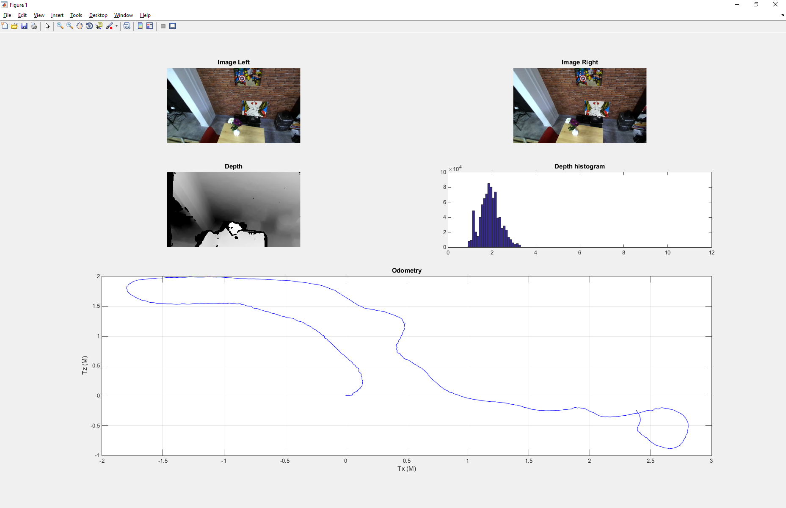

# zed-matlab

**This sample is designed to work with the ZED stereo camera only and requires the ZED SDK. For more information: https://www.stereolabs.com**

It demonstrates how to use most of the ZED SDK functionalities with Matlab.

**Warning :**
 - This sample is not designed to operate in real time

This sample displays the both left and right images of the ZED as well as the normalized depth map.
This sample also retrieve the depth information and then compute thru Matlab the depth histogram.
Since we added tracking skills to the SDK, the position of the ZED camera is also displayed.

## Build the program
To get more detailed instructions (especially for Windows) check out the  [documentation](https://www.stereolabs.com/blog/index.php/2015/09/11/how-to-use-the-zed-sdk-with-matlab/).

Open a terminal in zed-matlab directory and execute the following command:

    export MATLAB_ROOT=/usr/local/MATLAB/R2012b # Change this with your actual Matlab path
    mkdir build
    cd build
    cmake ../src
    make
    make install

## Run the program
In the matlab directory, open the file ZED_Camera.m with Matlab and press run.

### Troubleshooting

On Linux, If you get the following error :

     /usr/local/MATLAB/R2014a/bin/glnxa64/../../sys/os/glnxa64/libstdc++.so.6: version `GLIBCXX_3.4.21` not found

Launch matlab with `LD_PRELOAD`, like this :

    LD_PRELOAD=/usr/lib/x86_64-linux-gnu/libstdc++.so.6.0.21:/usr/lib/x86_64-linux-gnu/libfreetype.so.6 matlab&

You can create an alias to simplify the launch, in a bash terminal (just once) :

    echo "alias matlab=LD_PRELOAD=/usr/lib/x86_64-linux-gnu/libstdc++.so.6.0.21:/usr/lib/x86_64-linux-gnu/libfreetype.so.6 matlab&" >> ~/.bashrc

Then you can launch it normally, just by typing

    matlab

**Quit :**
Press any key to exit the program.

