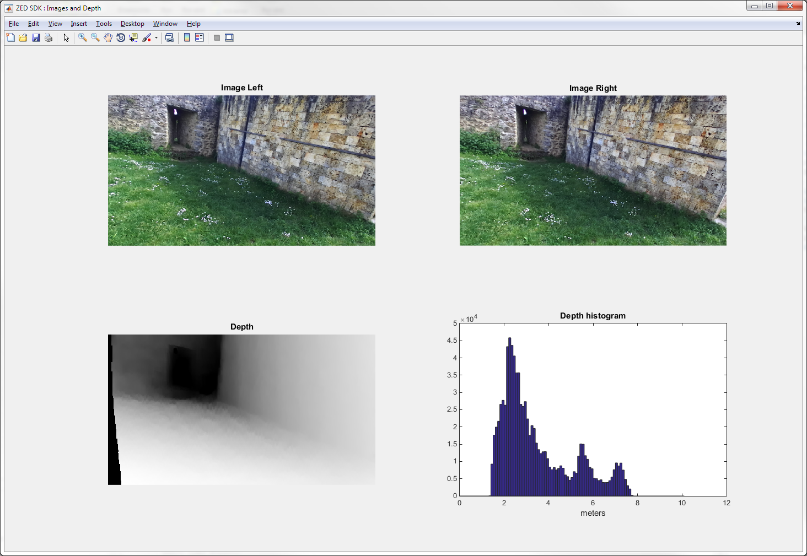
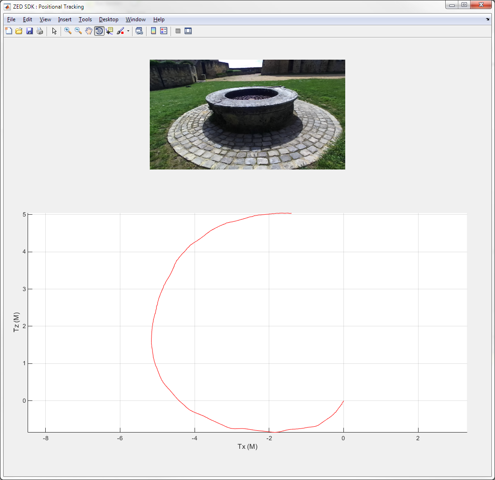

# Stereolabs ZED - Matlab Integration

This sample shows how to use the ZED SDK functionalities  within Matlab.

## Getting started

- First, download the latest version of the ZED SDK on [stereolabs.com](https://www.stereolabs.com).
- For more information, read the ZED [API documentation](https://www.stereolabs.com/developers/documentation/API/).

### Prerequisites

- Windows 7 64bits or later, Ubuntu 16.04
- Matlab with MEX compiler installed
- [ZED SDK](https://www.stereolabs.com/developers/) and its dependencies ([CUDA](https://developer.nvidia.com/cuda-downloads), [OpenCV 3.1](http://opencv.org/downloads.html))

## Build the program

#### Build for Windows

For detailed installation instructions, check out our [blog post](https://www.stereolabs.com/blog/index.php/2015/09/11/how-to-use-the-zed-sdk-with-matlab/).

#### Build for Linux

Download the sample and execute the following command in a terminal:

    export MATLAB_ROOT=/usr/local/MATLAB/R2012b # Put your actual Matlab path here
    mkdir build
    cd build
    cmake ../src
    make
    make install

## Run the program
In the Matlab directory, open the file `ZED_Camera.m` with Matlab and press run. Press any key to exit the program.

## Features

This sample is split into 3 parts, each of them shows a specific feature of the ZED SDK in Matlab.

1. `ZED_Camera.m` :

	In this part, we first initialize the ZED Camera and then retrieve both stereo images (Left and Right) as well as the depth data (32-bits float buffer) and the depth image normalized to 8-bits (grayscale). Then, with Matlab, we compute the depth histogram from the depth data values and display it.

	

2. `ZED_Tracking.m` :

	This part shows how to get the positional tracking information. First, we initialize the ZED camera and the tracking, then we display the current left image as well as all the positions of the camera.

	

3. `ZED_PointCloud.m` :

	This part shows how to initialize the ZED camera and retrieve for each frame the current point cloud (X,Y,Z) of the scene. Then we use the mesh function of Matlab to display it.

	

### Limitations
This sample application is not designed to run in real time

### Troubleshooting
On Linux, If you get the following error :

     /usr/local/MATLAB/R2014a/bin/glnxa64/../../sys/os/glnxa64/libstdc++.so.6: version `GLIBCXX_3.4.21` not found

Launch matlab with `LD_PRELOAD`:

    LD_PRELOAD=/usr/lib/x86_64-linux-gnu/libstdc++.so.6.0.21:/usr/lib/x86_64-linux-gnu/libfreetype.so.6 matlab&

You can also create an alias in a bash terminal (just once) to simplify the launch:

    echo "alias matlab=LD_PRELOAD=/usr/lib/x86_64-linux-gnu/libstdc++.so.6.0.21:/usr/lib/x86_64-linux-gnu/libfreetype.so.6 matlab&" >> ~/.bashrc

Then just launch the application by typing:

    matlab
